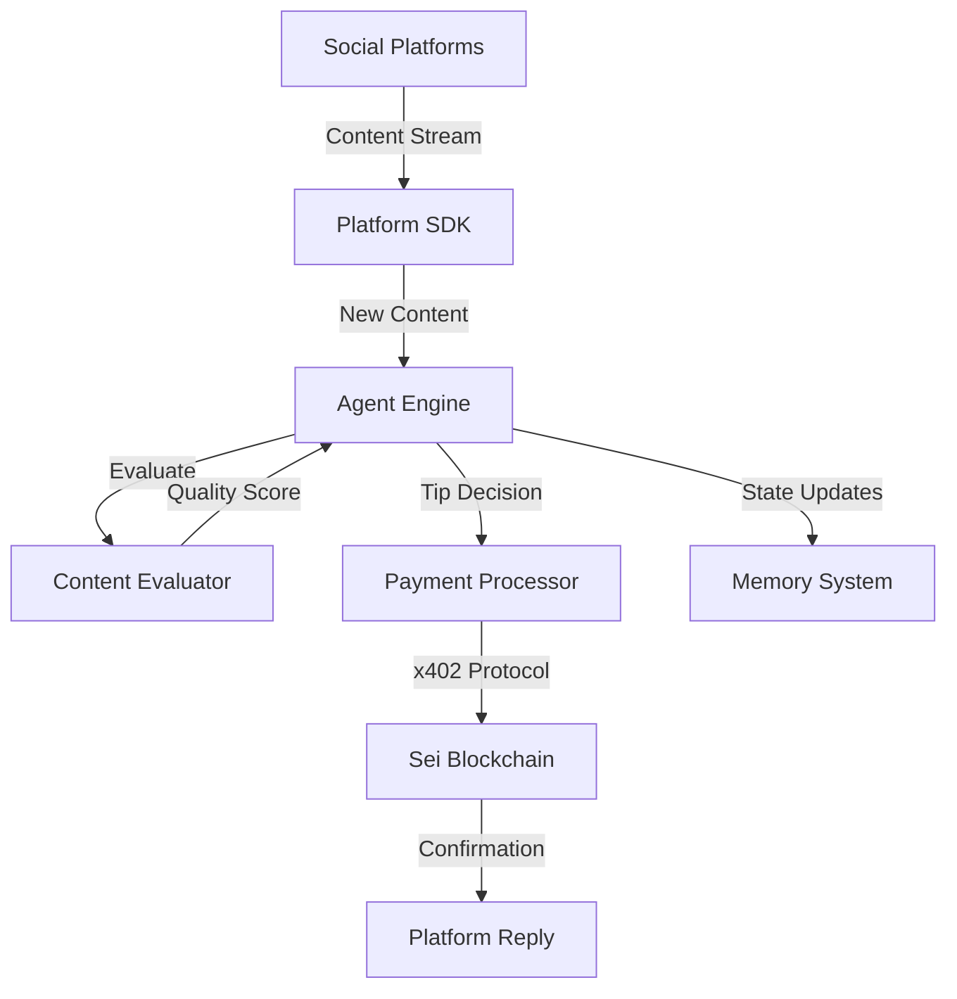
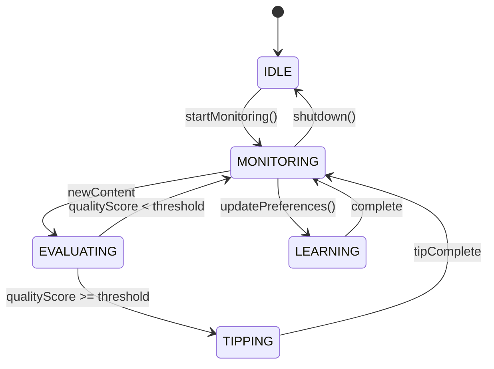

# Social Tipping Agent Architecture

## System Overview

The Social Tipping Agent is a sophisticated autonomous system that monitors social media platforms, evaluates content quality using AI, and automatically rewards creators with micropayments through the Sei blockchain.

## Core Components

### 1. Agent Engine (`src/core/agent-engine.ts`)
- **State Management**: Tracks agent states (IDLE, MONITORING, EVALUATING, TIPPING, LEARNING)
- **Decision Engine**: Makes autonomous tipping decisions based on quality scores
- **Budget Management**: Enforces daily spending limits and tip constraints
- **Event System**: Emits events for state changes and tip activities

### 2. Platform SDK (`src/platforms/platform-sdk.ts`)
- **Multi-Platform Support**: Unified interface for Twitter, Discord, LinkedIn
- **Content Streaming**: Real-time content monitoring with keyword filtering
- **Rate Limiting**: Respects API limits across platforms
- **Authentication**: Manages OAuth and API key authentication

### 3. Content Evaluator (`src/ai/content-evaluator.ts`)
- **AI Analysis**: Uses OpenAI GPT-4 for content quality assessment
- **Sentiment Analysis**: Evaluates emotional tone and engagement
- **Topic Matching**: Scores relevance to user preferences
- **Spam Detection**: Filters low-quality and spam content

### 4. Payment Processor (`src/payments/payment-processor.ts`)
- **x402 Integration**: Micropayments with sub-cent granularity
- **Transaction Management**: Handles payment execution and confirmation
- **Fee Calculation**: Manages protocol and network fees
- **Error Recovery**: Automatic retry with exponential backoff

### 5. Blockchain Integration (`src/blockchain/sei-integration.ts`)
- **Sei Network**: Sub-400ms finality for instant tips
- **Smart Contracts**: Records tips on-chain for transparency
- **Wallet Management**: Secure key management and signing
- **State Persistence**: On-chain agent configuration storage

## Data Flow



## State Machine



## Security Architecture

### Authentication
- **API Keys**: Encrypted storage in environment variables
- **OAuth 2.0**: Secure platform authentication
- **Wallet Security**: Hardware wallet support for production

### Authorization
- **Budget Limits**: Hard caps on daily spending
- **Tip Constraints**: Maximum single tip amounts
- **Platform Permissions**: Scoped API access

### Data Protection
- **Encryption**: AES-256 for sensitive data
- **Privacy**: No storage of personal user data
- **Audit Logs**: Complete transaction history

## Scalability Design

### Horizontal Scaling
- **Stateless Workers**: Multiple agent instances
- **Load Balancing**: Content distribution across workers
- **Queue System**: Redis for task distribution

### Performance Optimization
- **Caching**: Content and evaluation caching
- **Batch Processing**: Group transactions for efficiency
- **Async Operations**: Non-blocking I/O throughout

## Monitoring & Observability

### Metrics
- Tips per hour/day
- Average tip amount
- Platform distribution
- Creator rankings
- Budget utilization

### Logging
- Structured logging with Winston
- Log levels: ERROR, WARN, INFO, DEBUG
- Centralized log aggregation

### Alerts
- Budget threshold warnings
- API rate limit alerts
- Transaction failure notifications
- System health checks

## Deployment Architecture

### Development
```
Local → Docker → Testing
```

### Production
```
GitHub → CI/CD → AWS/GCP → Load Balancer → Agent Instances
```

### Infrastructure
- **Container**: Docker with Node.js 20
- **Orchestration**: Kubernetes for scaling
- **Database**: PostgreSQL for analytics
- **Cache**: Redis for session state
- **Monitoring**: Prometheus + Grafana

## API Design

### REST Endpoints
- `GET /health` - System health check
- `GET /stats` - Agent statistics
- `POST /preferences` - Update preferences
- `POST /tip` - Manual tip trigger

### WebSocket Events
- `stateChange` - Agent state updates
- `tipSent` - Successful tip notification
- `tipFailed` - Failed tip alert
- `budgetUpdate` - Budget status change

## Error Handling

### Retry Strategy
- Exponential backoff for API calls
- Circuit breaker for failing services
- Dead letter queue for failed tips

### Recovery Mechanisms
- Automatic state restoration
- Transaction rollback support
- Graceful degradation

## Future Enhancements

### Phase 2
- Machine learning for personalized quality assessment
- Multi-signature wallet support
- Advanced analytics dashboard
- Mobile application

### Phase 3
- DAO governance for tip parameters
- Cross-chain support
- NFT rewards for top creators
- Reputation system

## Technology Stack

### Core
- **Runtime**: Node.js 20.x
- **Language**: TypeScript 5.x
- **Framework**: Express.js

### Blockchain
- **Network**: Sei (CosmWasm)
- **SDK**: @sei-js/core
- **Payments**: x402 Protocol

### AI/ML
- **LLM**: OpenAI GPT-4
- **Embeddings**: text-embedding-3
- **Classification**: Custom models

### Infrastructure
- **Container**: Docker
- **CI/CD**: GitHub Actions
- **Monitoring**: Datadog
- **Cloud**: AWS/GCP